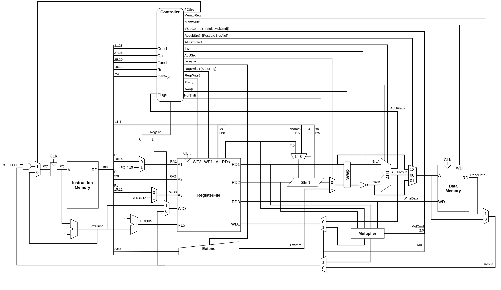

# arm cpu

## Support Instructions

### Data Processing

* *Opcode* Rd, Rn, Src2
  * AND, SUB, ADD, ORR, ,EOR, ADC, SBC, RSB, RSC, BIC, MVN, MOV
* *Opcode* Rn, Src2
  * CMP, CMN, TST, TEQ
* *Opcode* Rd, Rm, Rs/shamt5
  * LSL, LSR, ASR, ROR

### Memory

* *Opcode* Rd, [Rn]
  * STR, LDR

### Branch

* *Opcode* label
  * B

## Diagram

## Tables

### Main Decoder

| *Op*  | *Funct*5 | *Funct*0 |   Type   |     | *Branch* | *MemtoReg* | *MemW* | *ALUSrc* | *ImmSrc* | *RegW* | *RegSrc* | *ALUOp* |
| :---: | :-----------------: | :-----------------: | :------: | --- | :------: | :--------: | :----: | :------: | :------: | :----: | :------: | :-----: |
|  00   |          0          |          X          |  DP Reg  |     |    0     |     0      |   0    |    0     |    XX    |   1    |    00    |    1    |
|  00   |          1          |          X          |  DP Imm  |     |    0     |     0      |   0    |    1     |    00    |   1    |    X0    |    1    |
|  01   |          X          |          0          | STR(Imm) |     |    0     |     X      |   1    |    1     |    01    |   0    |    10    |    0    |
|  01   |          0          |          1          | LDR(Imm) |     |    0     |     1      |   0    |    1     |    01    |   1    |    X0    |    0    |
|  01   |          1          |          1          | LDR(Reg) |     |    0     |     1      |   0    |    0     |    01    |   1    |    00    |    0    |
|  10   |          X          |          X          |    B     |     |    1     |     0      |   0    |    1     |    10    |   0    |    X1    |    0    |

### ALU Decoder

| *ALUOp* | *Funct*4:1 (cmd) | *Funct*0 (S) |          Type           |     | *ALUControl*1:0 | *FlagW*1:0 | *NoWrite* | *Shift* | *Swap* | *inv* |
| :-----: | :-------------------------: | :---------------------: | :---------------------: | --- | :------------------------: | :-------------------: | :-------: | :-----: | :----: | :---: |
|    0    |              X              |            X            |          NotDP          |     |            000             |          00           |     0     |    0    |   0    |   0   |
|    1    |            0100             |            0            |           ADD           |     |            000             |          00           |     0     |    0    |   0    |   0   |
|    ^    |              ^              |            1            |            ^            |     |             ^              |          11           |     0     |    0    |   0    |   0   |
|    ^    |            0010             |            0            |           SUB           |     |            001             |          00           |     0     |    0    |   0    |   0   |
|    ^    |              ^              |            1            |            ^            |     |             ^              |          11           |     0     |    0    |   0    |   0   |
|    ^    |            0000             |            0            |           AND           |     |            010             |          00           |     0     |    0    |   0    |   0   |
|    ^    |              ^              |            1            |            ^            |     |             ^              |          10           |     0     |    0    |   0    |   0   |
|    ^    |            1100             |            0            |           ORR           |     |            011             |          00           |     0     |    0    |   0    |   0   |
|    ^    |              ^              |            1            |            ^            |     |             ^              |          10           |     0     |    0    |   0    |   0   |
|    ^    |            0001             |            0            |           EOR           |     |            110             |          00           |     0     |    0    |   0    |   0   |
|    ^    |              ^              |            1            |            ^            |     |             ^              |          10           |     0     |    0    |   0    |   0   |
|    ^    |            0101             |            0            |           ADC           |     |            100             |          00           |     0     |    0    |   0    |   0   |
|    ^    |              ^              |            1            |            ^            |     |             ^              |          11           |     0     |    0    |   0    |   0   |
|    ^    |            0110             |            0            |           SBC           |     |            101             |          00           |     0     |    0    |   0    |   0   |
|    ^    |              ^              |            1            |            ^            |     |             ^              |          11           |     0     |    0    |   0    |   0   |
|    ^    |            0011             |            0            |           RSB           |     |            001             |          00           |     0     |    0    |   1    |   0   |
|    ^    |              ^              |            1            |            ^            |     |             ^              |          11           |     0     |    0    |   1    |   0   |
|    ^    |            0111             |            0            |           RSC           |     |            101             |          00           |     0     |    0    |   1    |   0   |
|    ^    |              ^              |            1            |            ^            |     |             ^              |          11           |     0     |    0    |   1    |   0   |
|    ^    |            1110             |            0            |           BIC           |     |            010             |          00           |     0     |    0    |   0    |   1   |
|    ^    |              ^              |            1            |            ^            |     |             ^              |          10           |     0     |    0    |   0    |   1   |
|    ^    |            1010             |            1            |           CMP           |     |            001             |          11           |     1     |    0    |   0    |   0   |
|    ^    |            1011             |            1            |           CMN           |     |            000             |          11           |     1     |    0    |   0    |   0   |
|    ^    |            1000             |            1            |           TST           |     |            010             |          10           |     1     |    0    |   0    |   0   |
|    ^    |            1001             |            1            |           TEQ           |     |            110             |          10           |     1     |    0    |   0    |   0   |
|    ^    |            1111             |            0            |           MVN           |     |            0XX             |          00           |     0     |    1    |   0    |   1   |
|    ^    |              ^              |            1            |            ^            |     |             ^              |          10           |     0     |    1    |   0    |   0   |
|    ^    |            1101             |            0            | LSL, LSR, ASR, ROR, MOV |     |            0XX             |          00           |     0     |    1    |   0    |   0   |
|    ^    |              ^              |            1            |            ^            |     |             ^              |          10           |     0     |    1    |   0    |   0   |
