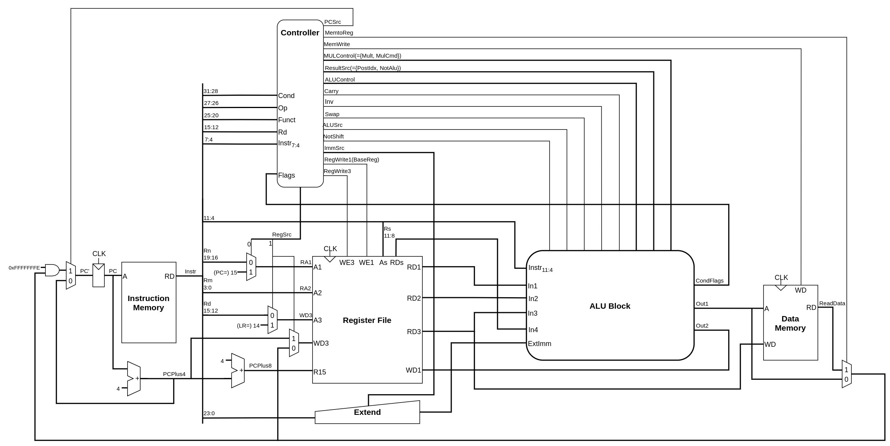
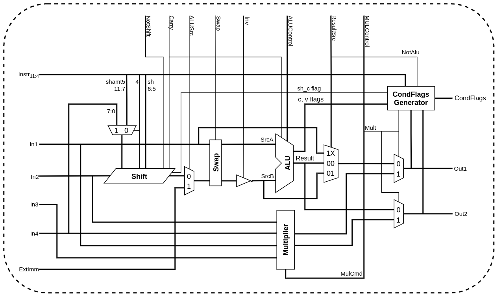

# arm cpu

## Requirements

* Icarus Verilog version 11.0

## Usage

```bash
$ cd test
$ python run_program.py programs/fizzbuzz_hex.dat
```

## Support Instructions

### Data Processing

* *Opcode* Rd, Rn, Src2
  * AND, SUB, ADD, ORR, ,EOR, ADC, SBC, RSB, RSC, BIC, MVN
* *Opcode* Rn, Src2
  * CMP, CMN, TST, TEQ
* *Opcode* Rd, Rm, Rs/shamt5
  * LSL, LSR, ASR, ROR, RRX
* *Opcode* Rd, Src2
  * MOV

### Multiply

* *Opcode* Rd, Rn, Rm
  * MUL
* *Opcode* Rd, Rn, Rm, Ra
  * MLA, UMULL, UMLAL, SMULL, SMLAL

### Memory

* *Opcode* Rd, [Rn, &plusmn;Src2]
  * STR, LDR
* IdxMode
  * [Rn, &plusmn;Src2] (offset)
  * [Rn], &plusmn;Src2 (postindex)
  * [Rn, &plusmn;Src2]! (preindex)

### Branch

* *Opcode* label
  * B, BL
* *Opcode* Rm
  * BX(Thumb state is not supported)

## Logic Diagram

### Top Module



### ALU Block



## Decoder

### Main Decoder

| *Op*  | *Funct* | *Instr*<sub>7:4</sub> |         Type         |     | *Branch* | *MemtoReg* | *MemW* | *ALUSrc* | *ImmSrc* | *RegW3* | *RegW1(BaseReg)* | *RegSrc* | *ALUOp* | *PostIndex* | *Mult* |
| :---: | :-----: | :-------------------: | :------------------: | --- | :------: | :--------: | :----: | :------: | :------: | :-----: | :--------------: | :------: | :-----: | :---------: | :----: |
|  00   | 0XXXXX  |         0XX1          |        DP Reg        |     |    0     |     0      |   0    |    0     |    XX    |    1    |        0         |    00    |    1    |      0      |   0    |
|  00   | 1XXXXX  |         XXXX          |        DP Imm        |     |    0     |     0      |   0    |    1     |    00    |    1    |        0         |    00    |    1    |      0      |   0    |
|  00   | 000XXX  |         1001          | DP Multiply (32-bit) |     |    0     |     0      |   0    |    0     |    XX    |    0    |        1         |    00    |    0    |      0      |   1    |
|  00   | 001XXX  |         1001          | DP Multiply (64-bit) |     |    0     |     0      |   0    |    0     |    XX    |    1    |        1         |    00    |    0    |      0      |   1    |
|  00   | 010010  |         0001          |          BX          |     |    1     |     0      |   0    |    0     |    XX    |    0    |        0         |    00    |    0    |      0      |   0    |
|  01   | 01XX00  |         XXXX          |   STR (Imm,Offset)   |     |    0     |     0      |   1    |    1     |    01    |    0    |        0         |    00    |    0    |      0      |   0    |
|  01   | 11XX00  |         XXX0          |   STR (Reg,Offset)   |     |    0     |     0      |   1    |    0     |    01    |    0    |        0         |    00    |    0    |      0      |   0    |
|  01   | 00XX00  |         XXXX          |  STR (Imm,PostIdx)   |     |    0     |     0      |   1    |    1     |    01    |    0    |        1         |    00    |    0    |      1      |   0    |
|  01   | 10XX00  |         XXX0          |  STR (Reg,PostIdx)   |     |    0     |     0      |   1    |    0     |    01    |    0    |        1         |    00    |    0    |      1      |   0    |
|  01   | 01XX10  |         XXXX          |   STR (Imm,PreIdx)   |     |    0     |     0      |   1    |    1     |    01    |    0    |        1         |    00    |    0    |      0      |   0    |
|  01   | 11XX10  |         XXX0          |   STR (Reg,PreIdx)   |     |    0     |     0      |   1    |    0     |    01    |    0    |        1         |    00    |    0    |      0      |   0    |
|  01   | 01XX01  |         XXXX          |   LDR (Imm,Offset)   |     |    0     |     1      |   0    |    1     |    01    |    1    |        0         |    00    |    0    |      0      |   0    |
|  01   | 11XX01  |         XXX0          |   LDR (Reg,Offset)   |     |    0     |     1      |   0    |    0     |    01    |    1    |        0         |    00    |    0    |      0      |   0    |
|  01   | 00XX01  |         XXXX          |  LDR (Imm,PostIdx)   |     |    0     |     1      |   0    |    1     |    01    |    1    |        1         |    00    |    0    |      1      |   0    |
|  01   | 10XX01  |         XXX0          |  LDR (Reg,PostIdx)   |     |    0     |     1      |   0    |    0     |    01    |    1    |        1         |    00    |    0    |      1      |   0    |
|  01   | 01XX11  |         XXXX          |   LDR (Imm,PreIdx)   |     |    0     |     1      |   0    |    1     |    01    |    1    |        1         |    00    |    0    |      0      |   0    |
|  01   | 11XX11  |         XXX0          |   LDR (Reg,PreIdx)   |     |    0     |     1      |   0    |    0     |    01    |    1    |        1         |    00    |    0    |      0      |   0    |
|  10   | 10XXXX  |         XXXX          |          B           |     |    1     |     0      |   0    |    1     |    10    |    0    |        0         |    01    |    0    |      0      |   0    |
|  10   | 11XXXX  |         XXXX          |          BL          |     |    1     |     0      |   0    |    1     |    10    |    1    |        0         |    11    |    0    |      0      |   0    |

### ALU Decoder

| *ALUOp* | *Mult* | *Branch* | *Funct*<sub>4:1</sub> (cmd) | *Funct*<sub>0</sub> (S) |             Type             |     | *ALUControl*<sub>2:0</sub> | *FlagW*<sub>1:0</sub> | *NoWrite* | *NotAlu* | *NotShift* | *Swap* | *Inv* |
| :-----: | :----: | :------: | :-------------------------: | :---------------------: | :--------------------------: | --- | :------------------------: | :-------------------: | :-------: | :------: | :--------: | :----: | :---: |
|    0    |   0    |    0     |            X1XX             |            X            |         Memory (ADD)         |     |            000             |          00           |     0     |    0     |     0      |   0    |   0   |
|    ^    |   ^    |    ^     |            X0XX             |            ^            |         Memory (SUB)         |     |            001             |          00           |     0     |    0     |     0      |   0    |   0   |
|    0    |   1    |    0     |            0XXX             |            0            |           Multiply           |     |            000             |          00           |     0     |    0     |     0      |   0    |   0   |
|    ^    |   ^    |    ^     |              ^              |            1            |              ^               |     |             ^              |          10           |     0     |    0     |     0      |   0    |   0   |
|    0    |   0    |    1     |            XXXX             |            X            |        Branch (B, BL)        |     |            000             |          00           |     0     |    0     |     0      |   0    |   0   |
|    0    |   0    |    1     |            1001             |            0            |         Branch (BX)          |     |            000             |          00           |     0     |    1     |     1      |   0    |   0   |
|    1    |   0    |    X     |            0100             |            0            |             ADD              |     |            000             |          00           |     0     |    0     |     0      |   0    |   0   |
|    ^    |   0    |    X     |              ^              |            1            |              ^               |     |             ^              |          11           |     0     |    0     |     0      |   0    |   0   |
|    ^    |   0    |    X     |            0010             |            0            |             SUB              |     |            001             |          00           |     0     |    0     |     0      |   0    |   0   |
|    ^    |   0    |    X     |              ^              |            1            |              ^               |     |             ^              |          11           |     0     |    0     |     0      |   0    |   0   |
|    ^    |   0    |    X     |            0000             |            0            |             AND              |     |            010             |          00           |     0     |    0     |     0      |   0    |   0   |
|    ^    |   0    |    X     |              ^              |            1            |              ^               |     |             ^              |          10           |     0     |    0     |     0      |   0    |   0   |
|    ^    |   0    |    X     |            1100             |            0            |             ORR              |     |            011             |          00           |     0     |    0     |     0      |   0    |   0   |
|    ^    |   0    |    X     |              ^              |            1            |              ^               |     |             ^              |          10           |     0     |    0     |     0      |   0    |   0   |
|    ^    |   0    |    X     |            0001             |            0            |             EOR              |     |            110             |          00           |     0     |    0     |     0      |   0    |   0   |
|    ^    |   0    |    X     |              ^              |            1            |              ^               |     |             ^              |          10           |     0     |    0     |     0      |   0    |   0   |
|    ^    |   0    |    X     |            0101             |            0            |             ADC              |     |            100             |          00           |     0     |    0     |     0      |   0    |   0   |
|    ^    |   0    |    X     |              ^              |            1            |              ^               |     |             ^              |          11           |     0     |    0     |     0      |   0    |   0   |
|    ^    |   0    |    X     |            0110             |            0            |             SBC              |     |            101             |          00           |     0     |    0     |     0      |   0    |   0   |
|    ^    |   0    |    X     |              ^              |            1            |              ^               |     |             ^              |          11           |     0     |    0     |     0      |   0    |   0   |
|    ^    |   0    |    X     |            0011             |            0            |             RSB              |     |            001             |          00           |     0     |    0     |     0      |   1    |   0   |
|    ^    |   0    |    X     |              ^              |            1            |              ^               |     |             ^              |          11           |     0     |    0     |     0      |   1    |   0   |
|    ^    |   0    |    X     |            0111             |            0            |             RSC              |     |            101             |          00           |     0     |    0     |     0      |   1    |   0   |
|    ^    |   0    |    X     |              ^              |            1            |              ^               |     |             ^              |          11           |     0     |    0     |     0      |   1    |   0   |
|    ^    |   0    |    X     |            1110             |            0            |             BIC              |     |            010             |          00           |     0     |    0     |     0      |   0    |   1   |
|    ^    |   0    |    X     |              ^              |            1            |              ^               |     |             ^              |          10           |     0     |    0     |     0      |   0    |   1   |
|    ^    |   0    |    X     |            1010             |            1            |             CMP              |     |            001             |          11           |     1     |    0     |     0      |   0    |   0   |
|    ^    |   0    |    X     |            1011             |            1            |             CMN              |     |            000             |          11           |     1     |    0     |     0      |   0    |   0   |
|    ^    |   0    |    X     |            1000             |            1            |             TST              |     |            010             |          10           |     1     |    0     |     0      |   0    |   0   |
|    ^    |   0    |    X     |            1001             |            1            |             TEQ              |     |            110             |          10           |     1     |    0     |     0      |   0    |   0   |
|    ^    |   0    |    X     |            1111             |            0            |             MVN              |     |            000             |          00           |     0     |    1     |     0      |   0    |   1   |
|    ^    |   0    |    X     |              ^              |            1            |              ^               |     |             ^              |          10           |     0     |    1     |     0      |   0    |   0   |
|    ^    |   0    |    X     |            1101             |            0            | LSL, LSR, ASR, ROR, RRX, MOV |     |            000             |          00           |     0     |    1     |     0      |   0    |   0   |
|    ^    |   0    |    X     |              ^              |            1            |              ^               |     |             ^              |          10           |     0     |    1     |     0      |   0    |   0   |


## References

* Sarah Harris & David Harris, *Digital Design and Computer Architecture: ARM Edition*
* [ARMv5 Architecture Reference Manual](https://developer.arm.com/documentation/ddi0100/i)
